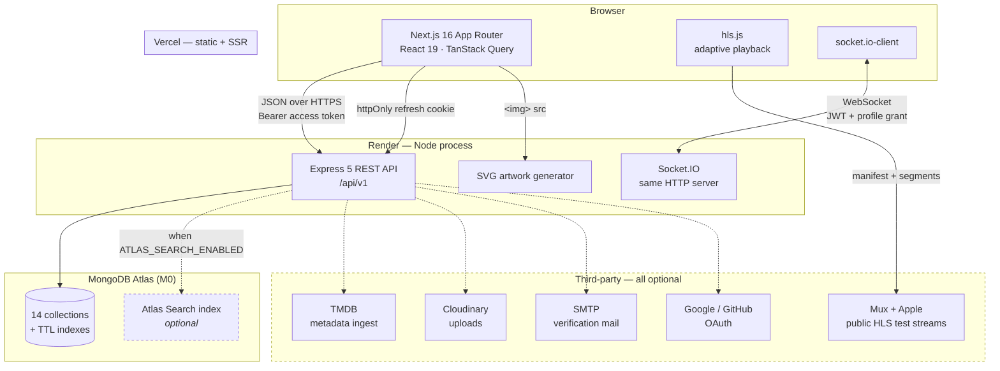
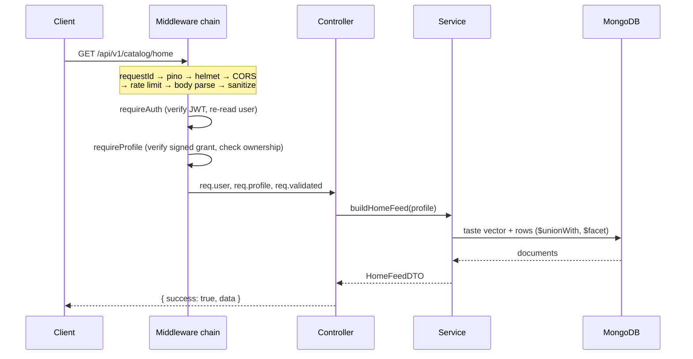
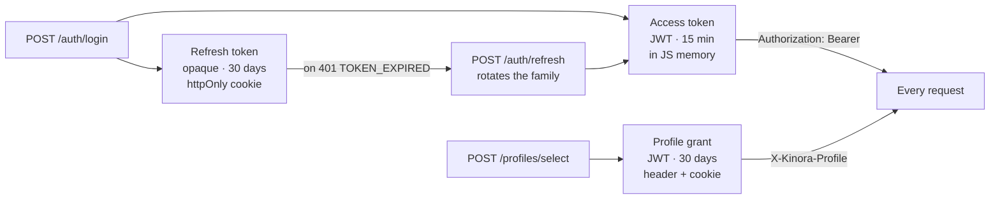
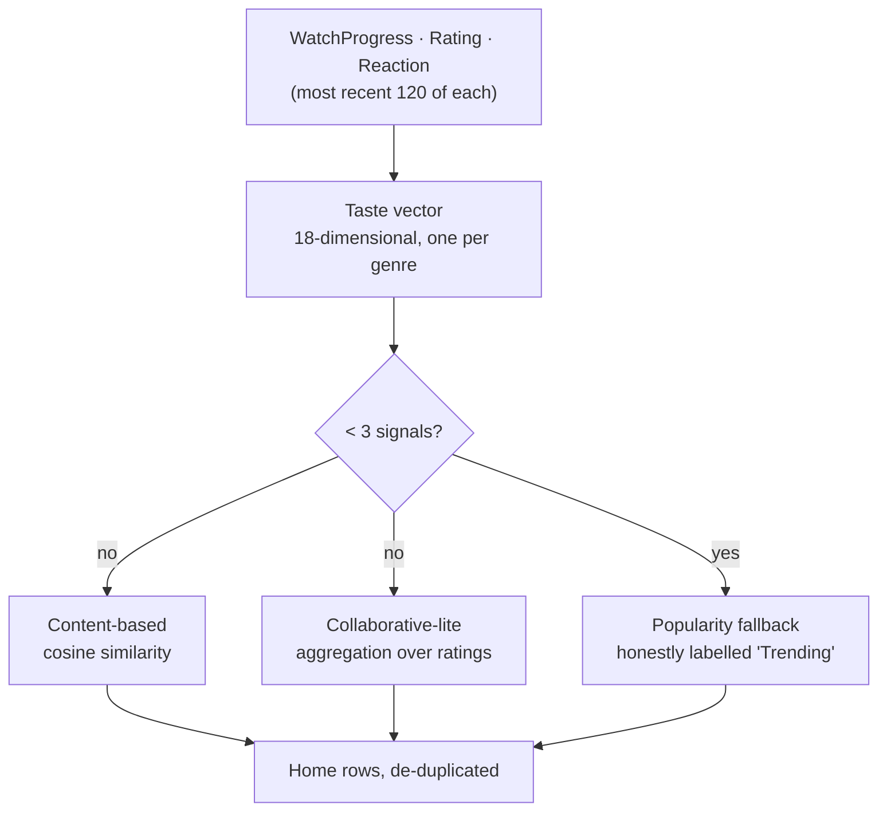

# Architecture

## System overview

Everything with a dashed border is optional. With none of it configured the app
still runs: search falls back to a MongoDB text index, artwork is generated as
SVG, verification links are logged instead of emailed, OAuth buttons are hidden,
and uploads fall back to local disk. That is the offline-first constraint, and
it is why a reviewer can `git clone && npm run dev` with an empty `.env`.

## Request lifecycle

Rate limiting sits **before** body parsing so a flood costs a counter increment
rather than a JSON parse. Sanitisation sits **after** parsing because it edits
the parsed body. Auth sits after both so an unauthenticated flood is rejected
without a database round trip.

## Layering

| Layer | Owns | Never does |
|---|---|---|
| `routes/` | URL shape, middleware composition | Business logic |
| `middleware/` | Cross-cutting concerns (auth, validation, limits, errors) | Domain decisions |
| `controllers/` | Parse validated input, call one service, shape the response | Query the database |
| `services/` | Business logic, queries, aggregations | Touch `req`/`res` |
| `models/` | Schema, indexes, document methods | Know about HTTP |

The rule that keeps this honest: a controller never imports a model, and a
service never imports `express`. Both are checkable by grep, which is what makes
the boundary survive contact with a deadline.

## Authentication

Three token types, each with a different job:

- **Access token** is a JWT so it verifies without a database hit — but
  `requireAuth` still loads the user, because a JWT cannot know the account was
  deleted or demoted thirty seconds ago. `credentialsChangedAt` invalidates
  tokens issued before a password change.
- **Refresh token** is opaque, not a JWT: revocation has to be authoritative and
  a self-contained token cannot be un-issued. Only its SHA-256 digest is stored.
  Tokens form a *family* per login; replaying a rotated token revokes the whole
  family, which is the standard reuse-detection response.
- **Profile grant** proves the profile was actually selected — and that its PIN,
  if any, was satisfied. A bare profile id in a header would be forgeable, which
  would reduce PIN locks to decoration.

## Data model

See [`docs/schema.md`](./schema.md) for the collection diagram.

## Recommendation pipeline

Weights are asymmetric on purpose: a dislike is `-5` against a completed watch
at `+3`, because one bad experience should move the vector further than one
passive one. Each title's weight is divided across its genres so a five-genre
title does not count five times.

## Deliberate trade-offs

| Decision | Why | What breaks at scale |
|---|---|---|
| Read-time feed fan-out | Simple; no duplication | A celebrity account with 100k followers |
| In-memory rate limiting | One free-tier dyno | Multiple instances each get their own budget |
| In-memory party presence | Same | Presence splits across instances |
| Analytics computed per request | Milliseconds at this size | Needs rollups past ~10⁶ watch rows |
| Denormalised `averageScore` | Sorting without a join | Recompute drifts if a writer is missed |
| Levenshtein fuzzy fallback | Works without Atlas | O(candidates); Atlas Search does it properly |

Every one of these is the right call for a free-tier portfolio deployment and
the wrong call for a product with real traffic. Knowing which is which is the
point.
