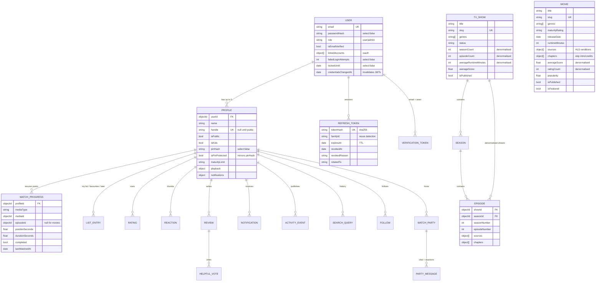

# Database schema

MongoDB, 14 collections. Mongoose enforces the schema; the indexes below are the
ones the query patterns actually need, not decoration.



## Why two catalog collections

`movies` and `tvshows` are separate rather than one polymorphic collection with
a `type` discriminator. Their fields genuinely differ — a movie has
`runtimeMinutes` and inline `sources`, a show has `seasonCount` and delegates
playback to episodes — and a single collection would be half-null in every
document.

Browse needs them merged, which `$unionWith` does in one pipeline:

```js
Movie.aggregate([
  { $match: filter },
  { $addFields: { mediaType: 'movie' } },
  { $unionWith: { coll: 'tvshows', pipeline: [
      { $match: filter },
      { $addFields: { mediaType: 'tv', releaseDate: '$firstAirDate' } },
  ]}},
  { $sort: { popularity: -1, _id: 1 } },
  { $facet: { items: [...], total: [{ $count: 'count' }] } },
])
```

One sort, one pagination pass, one round trip. Merging in Node would mean
over-fetching from both sides to page correctly.

## Index inventory

| Collection | Index | Serves |
|---|---|---|
| users | `email` unique | Login |
| users | `linkedAccounts.provider + providerId` sparse | OAuth lookup |
| profiles | `userId + name` unique | One "Sam" per account |
| profiles | `handle` unique **partial** (`$type: string`) | Global handles |
| movies / tvshows | `isPublished + popularity` | Default browse sort |
| movies / tvshows | `isPublished + genres + popularity` | Genre rows |
| movies / tvshows | `title/overview/keywords` **text** | Local search fallback |
| episodes | `showId + seasonNumber + episodeNumber` unique | Ordering + next-episode |
| watchprogresses | `profileId + mediaType + mediaId + episodeId` unique | One row per item |
| watchprogresses | `profileId + completed + lastWatchedAt` | Continue Watching |
| listentries | `profileId + kind + mediaType + mediaId` unique | Idempotent add |
| ratings | `mediaId + score` | Collaborative filtering, step 1 |
| ratings | `profileId + score` | Collaborative filtering, step 2 |
| follows | `followerProfileId + followingProfileId` unique | One edge per pair |
| refreshtokens | `expiresAt` **TTL** | Automatic session cleanup |

### The partial index that matters

`profiles.handle` uses `partialFilterExpression: { handle: { $type: 'string' } }`
rather than `sparse: true`. A sparse index skips documents where the field is
*absent*, but `handle` has `default: null` — so every handle-less profile stores
an explicit null and they all collide under a sparse unique index. This was a
real bug during the build: registration started failing with "That handle is
already taken" on the *second* account. Partial indexing on "is actually a
string" is the correct expression of "unique among those that have one".

## TTL policy

Ephemeral collections expire themselves rather than needing a cleanup job:

| Collection | Lifetime | Why |
|---|---|---|
| `refreshtokens` | 24h past expiry | Grace window so reuse detection still finds the family |
| `verificationtokens` | 24h | Links are already single-use |
| `watchparties` | 24h after last activity | Parties are ephemeral |
| `partymessages` | 24h | Chat outlives the party by a day, not forever |
| `notifications` | 30 days | Older than that is not a notification |
| `searchqueries` | 30 days | "Trending" means recent |
| `activityevents` | 60 days | A feed older than that is not a feed |

This matters on Atlas M0: 512 MB total, and the ephemeral collections are the
ones that would otherwise grow without bound.

## Denormalisation

Four values are stored redundantly, each to avoid a join on a hot read path:

| Field | Source of truth | Refreshed by |
|---|---|---|
| `movie.averageScore` / `ratingCount` | `ratings` | `review.service.refreshAggregate` on every rating write |
| `tvshow.seasonCount` / `episodeCount` / `averageRuntimeMinutes` | `seasons`, `episodes` | `admin.service.recountShow` on structural edits |
| `season.episodeCount` | `episodes` | Same |
| `partymessage.profileName` | `profiles` | Never — a chat log should read correctly after a rename |
| `activityevent.mediaTitle` / `mediaSlug` | catalog | Never — a feed entry is a historical record |

The first three are **recomputed**, not incremented. A recount cannot drift; an
increment can, and silently.
